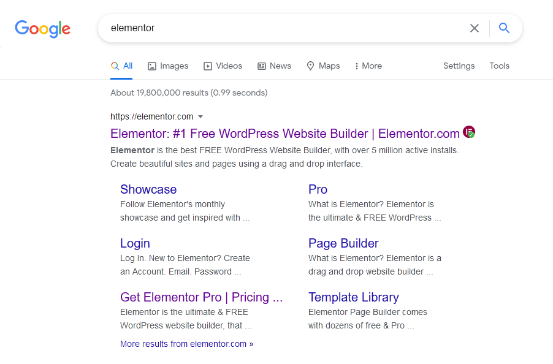
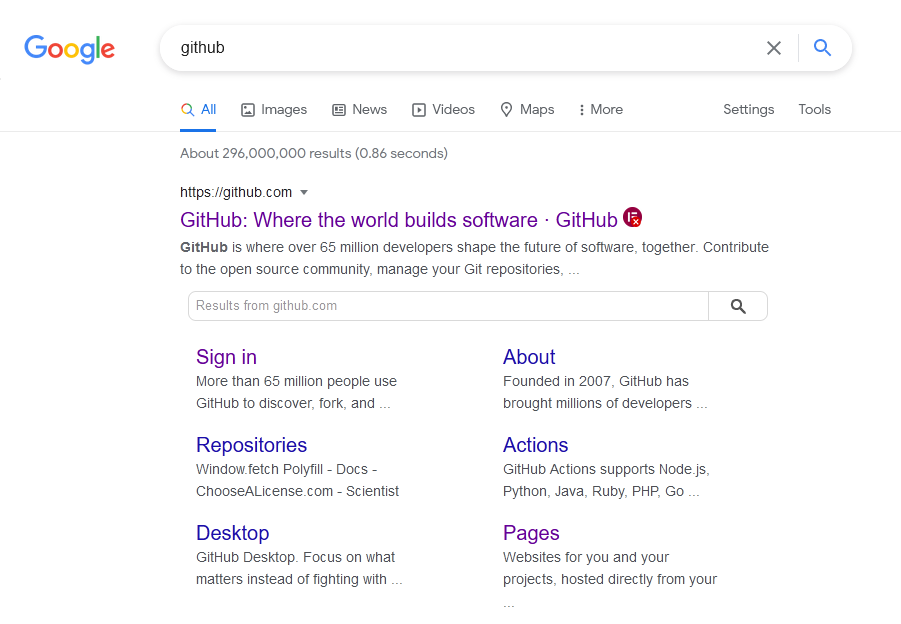

    

# Is It Elementor?
Check if a website is an Elementor website on Google Search.

A browser extension that lets you see right in the Google Search results if a website is built with Elementor!

